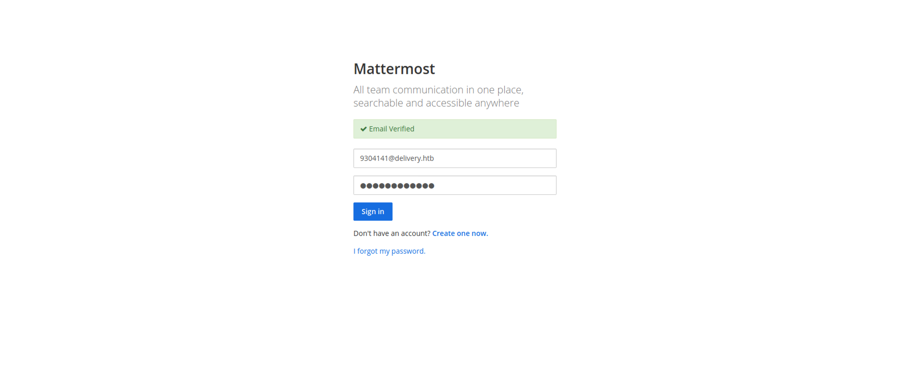

# Delivery

## Details

- **Points**: 20
- **Difficulty**: Easy
- **Operating System**: Linux
- **IP Address**: 10.10.10.222

## Table of Contents

- Foothold & User
  - [Network Scanning](#network-scanning)
  - [Web Application Enumeration](#web-application-enumeration)
  - [Getting the Email Address](#getting-the-email-address)
  - [Accessing the MatterMost Server](#accessing-the-mattermost-server)
  - [Getting the User Flag](#getting-the-user-flag)
- Root
  - [Accessing MatterMost Configuration](#accessing-mattermost-configuration)
  - [Accessing the Database](#accessing-the-database)
  - [Cracking the Password Hash](#cracking-the-password-hash)
  - [Getting the Root Flag](#getting-the-root-flag)

## Walkthrough

### Network Scanning

Firstly, we can start with network scanning using Nmap to find out which ports are open.

```
$ nmap -T4 -p- 10.10.10.222
Starting Nmap 7.91 ( https://nmap.org ) at 2021-04-20 21:30 AEST
Stats: 0:00:01 elapsed; 0 hosts completed (1 up), 1 undergoing Connect Scan
Connect Scan Timing: About 7.76% done; ETC: 21:30 (0:00:12 remaining)
Nmap scan report for 10.10.10.222
Host is up (0.031s latency).
Not shown: 65532 closed ports
PORT     STATE SERVICE
22/tcp   open  ssh
80/tcp   open  http
8065/tcp open  unknown

Nmap done: 1 IP address (1 host up) scanned in 9.54 seconds
```

Here, port 22, 80 and 8065 are open.

### Web Application Enumeration

Since port 80 is open, there is a webserver running on the machine. Let's check it out.


The word **HELPDESK** links us to `helpdesk.delivery.htb`, which we can't visit currently since our machine can't translate the domain name to the ip address. Therefore, we need to insert the following line into `/etc/hosts`

```
10.10.10.222 delivery.htb helpdesk.delivery.htb
```

Once it is done, we can visit the website using the url instead of using the ip address as `/etc/hosts` helps us translate the domain names to the corresponding ip addresses.

Next, let's explore the website. We can click on the **CONTACT US** button.


As before, clicking on **HelpDesk** redirects us to `helpdesk.delivery.htb`.


While clicking on **MatterMost server** redirects us to the open port 8065, which we found earlier during the network scanning.


### Getting the Email Address

As mentioned in the contact us page, our next objective is to obtain an `@delivery.htb` email address from `helpdesk.delivery.htb`.


Firstly, we can open a new ticket.


Simply enter a random email address, full name and so on. Once it is done, click on **Create Ticket** and we should get our `@delivery.htb` email address.


To verify this, we can click on **Check Ticket Status**, enter the email address that we used to fill up the form when opening the ticket and the ticket number. Then, click **View Ticket**.


### Accessing the MatterMost Server

According to the contact us page, once we have got the email address, we can have access to the MatterMost server on port 8065. So, let's try it.


What we can try is to create a new account on the MatterMost server.


We can use our `@delivery.htb` email address to create the account and a random username and password.

Once we're done, we will be asked to verify our email, which can be done by viewing our ticket on `helpdesk.delivery.htb`.


Activate the email by visiting the given link and login to your MatterMost account.



Once logged in, simply skip the tutorial and we will be able to access and view the messages in the Internal channel.


### Getting the User Flag

In the Internal channel, we can get the credential to SSH into the server.


Open the terminal and enter the following command

```
ssh maildeliverer@delivery.htb
```

When asked for a password, enter `Youve_G0t_Mail!` and we should be logged in to the server.


### Accessing MatterMost Configuration

Since MatterMost is a software obtained from an independent source, we can probably find its directory and configuration in `/opt`.


Now, let's list out the files in the `config` directory.


`config.json` seems interesting. Let's read the content of the file.


### Accessing the Database

In `config.json`, we find the settings for a SQL database. Next, we can access the database using the credentials listed in the settings, which is `mmuser:Crack_The_MM_Admin_PW`, by entering the following command

```
mysql -u mmuser -p
```

When asked for a password, enter `Crack_The_MM_Admin_PW`.


Next, list the available databases using `show databases;`. In this case, we know that there is a mattermost database from the configuration that we found earlier, so, we can use it with `use mattermost;`.


List out the tables in the mattermost database with `show tables;`.


As we can see, there is a `Users` table, which might contain the username and password of each account in the MatterMost server. We can verify this using the following command

```
show columns from Users;
```


Let's list out every username and password.


Finally, we can obtain the hashed password of the root user.

```
$2a$10$VM6EeymRxJ29r8Wjkr8Dtev0O.1STWb4.4ScG.anuu7v0EFJwgjjO
```

### Cracking the Password Hash

Our next objective is to crack the password hash of the root account, which can be done with hashcat.

In the Internal channel of the MatterMost server, the root account mentioned something about using a variant of `PleaseSubscribe!` as the password. We can use this in our wordlist.


Firstly, create a new file to contain the password hash of the root account. In this case, I used `target_hash.txt`.

Next, create another file to contain the wordlist. In this case, I used `wordlist.txt`.


Finally, we can crack the password with the following command

```
hashcat -a 0 -m 3200 target_hash.txt wordlist.txt -r /usr/share/hashcat/rules/best64.rule -o cracked
```

`-a 0` means we are using the "straight" attack mode, which simply try out all words in the wordlist
`-m 3200` means the hash was created with the bcrypt algorithm. We know this since the hash started with `$2a$`
`-r /usr/share/hashcat/rules/best64.rule` means we are using hashcat `best64` rule, which will append some numbers and perform other transformations to each word in the wordlist.


As we can see, the password of the root account is `PleaseSubscribe!21`.

### Getting the Root Flag

Finally, we can simply execute `su` since we have logged in as `maildeliverer`. When asked for a password, enter `PleaseSubscribe!21`.


